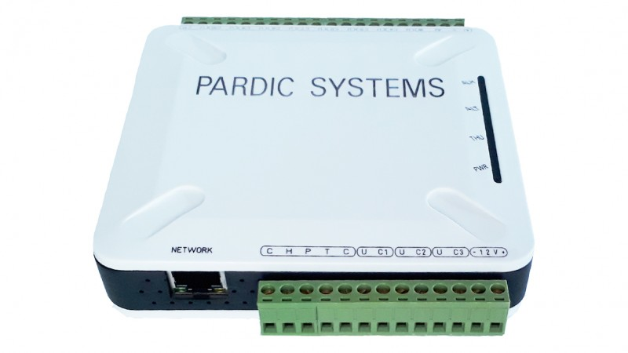

# ENV-Exporter

Prometheus SNMP Exporter for the **NS-705 SNMP Server Room Controller** — an Environmental Monitoring System (EMS) that monitors temperature, humidity, smoke, power inputs, and triggers alarms for server room environments.

---

## Table of Contents

- [Device Overview](#device-overview)
- [Sensors](#sensors)
- [Architecture](#architecture)
- [Prerequisites](#prerequisites)
- [Installation](#installation)
  - [Binary (Native)](#binary-native)
  - [Docker](#docker)
- [Configuration](#configuration)
  - [snmp.yml](#snmps-yml)
  - [Running the Exporter](#running-the-exporter)
- [Prometheus Scrape Job](#prometheus-scrape-job)
- [Verification](#verification)
- [Resources](#resources)

---

## Device Overview

| Property | Value |
|---|---|
| **Model** | NS-705 SNMP Server Room Controller |
| **Manufacturer** | Pardik (پاردیک) — Pardis Engineering Co. |
| **Purpose** | Environmental monitoring for server rooms and data centers |
| **Protocol** | SNMP v1 |
| **Community** | public |
| **IP Address** | 192.168.X.X |
| **Web Interface** | http://192.168.X.X (Deafult Username/Password: admin/admin) |

### Key Features

- High-precision temperature and humidity control via TDC-23 and THC-22 sensors
- Configurable setpoints for temperature and humidity thresholds
- Automatic activation of reserve coolers on temperature rise
- Support for 2–3 external sensor zones per device
- Smoke, water leak, and power failure detection per zone
- Multiple dry-contact outputs for remote power cycling (reset/reboot) of server equipment
- Audible and visual alarm triggering
- Automatic ping-based server/router health check with auto-reboot on hang detection
- Full SNMP-based reporting to network monitoring tools (e.g. PRTG)
- Web-based panel for configuration and network parameter changes
- Password-protected access

### Device Photo



See [resources/](resources/) for the full product datasheet (`NS-705_SNMP Server room controller.pdf`).

---

## Sensors

The NS-705 exposes the following sensors via SNMP, currently monitored in PRTG under **ROOT → Local Probe → Environmental Parameters** (192.168.X.X):

| # | Sensor Name | PRTG Value | Type | Description |
|---|---|---|---|---|
| 1 | Temp 1 (Rack1-Front) | 29 °C | snmpcustom | Temperature at Rack 1 front |
| 2 | Temp 2 (Rack2-Rear) | 32 °C | snmpcustom | Temperature at Rack 2 rear |
| 3 | Temp 3 (Rack3-Rear) | 32 °C | snmpcustom | Temperature at Rack 3 rear |
| 4 | Temp 4 (Rack5-Front) | 26 °C | snmpcustom | Temperature at Rack 5 front |
| 5 | THC | 26 (composite) | snmpcustom | Temperature-Humidity Composite sensor |
| 6 | Smoke | 0 (normal) | snmpcustom | Smoke detector (0 = no smoke) |
| 7 | Power 1 | 1 (active) | snmpcustom | Main power input status |
| 8 | Power 2 (Input Generator) | 0 (inactive) | snmpcustom | Generator power input status |
| 9 | Power Outage | Paused | xmlexe | Power outage detection (paused in PRTG) |

All sensors use `snmpcustom` (raw OID) or `xmlexe` sensor type in PRTG.

---

## Architecture

```
┌─────────────────────┐         SNMP v1          ┌──────────────────────┐
│   NS-705 EMS Device │ ◄──────────────────────► │   snmp_exporter       │
│     192.168.X.X     │    community: public     │   :9116               │
│                     │                          │   (this project)      │
│  • 4× Temp sensors  │                          └──────────┬───────────┘
│  • THC sensor       │                                     │ HTTP
│  • Smoke detector   │                                     ▼
│  • 2× Power inputs  │                          ┌──────────────────────┐
│  • Dry-contact I/O  │                          │   Prometheus          │
└─────────────────────┘                          │   (scrape :9116)      │
                                                 └──────────────────────┘
```

---

## Prerequisites

- **Go 1.22+** (for building from source)
- **snmp_exporter** binary or Docker image
- Network reachability to `192.168.X.X:161/udp` (same L2/L3 network or routed)
- Prometheus server (for scrape configuration)

---

## Installation

### Binary (Native)

```bash
# Download the latest release
wget https://github.com/prometheus/snmp_exporter/releases/download/v0.30.1/snmp_exporter-0.30.1.darwin-amd64.tar.gz
tar xzf snmp_exporter-0.30.1.darwin-amd64.tar.gz
sudo mv snmp_exporter-0.30.1.darwin-amd64/snmp_exporter /usr/local/bin/
```

### Docker

```bash
docker run -d \
  --name snmp_exporter_env \
  --restart unless-stopped \
  -p 9116:9116 \
  -v $(pwd)/snmp.yml:/etc/snmp_exporter/snmp.yml:ro \
  prom/snmp-exporter:v0.30.1 \
  --config.file=/etc/snmp_exporter/snmp.yml
```

---

## Configuration

### snmp.yml

The snmp.yml configuration file uses the `auths` + `modules` structure required by snmp_exporter v0.30.x:

```yaml
auths:
  ns705_v1:
    version: 1
    community: public

modules:
  ns705:
    walk:
      # Walk the device's OID subtree to discover all available metrics.
      # Replace with actual NS-705 OID once discovered via snmpwalk:
      - 1.3.6.1.2.1.1           # System MIB (sysDescr, sysUpTime, etc.)
      - 1.3.6.1.4.1.<enterprise>  # Enterprise-specific subtree (TBD)

    metrics:
      # --- System ---
      - name: sysDescr
        oid: 1.3.6.1.2.1.1.1.0
        type: DisplayString
        help: Device system description.

      - name: sysUpTime
        oid: 1.3.6.1.2.1.1.3.0
        type: gauge
        help: Device uptime in TimeTicks.

      # --- Temperature Sensors (4 zones) ---
      - name: envTemp1Rack1Front
        oid: 1.3.6.1.4.1.<enterprise>.<temp1_oid>  # TBD
        type: gauge
        help: Temperature at Rack 1 Front in Celsius.

      - name: envTemp2Rack2Rear
        oid: 1.3.6.1.4.1.<enterprise>.<temp2_oid>  # TBD
        type: gauge
        help: Temperature at Rack 2 Rear in Celsius.

      - name: envTemp3Rack3Rear
        oid: 1.3.6.1.4.1.<enterprise>.<temp3_oid>  # TBD
        type: gauge
        help: Temperature at Rack 3 Rear in Celsius.

      - name: envTemp4Rack5Front
        oid: 1.3.6.1.4.1.<enterprise>.<temp4_oid>  # TBD
        type: gauge
        help: Temperature at Rack 5 Front in Celsius.

      # --- THC (Temperature-Humidity Composite) ---
      - name: envTHC
        oid: 1.3.6.1.4.1.<enterprise>.<thc_oid>  # TBD
        type: gauge
        help: Composite Temperature-Humidity sensor value.

      # --- Smoke Detector ---
      - name: envSmokeStatus
        oid: 1.3.6.1.4.1.<enterprise>.<smoke_oid>  # TBD
        type: gauge
        help: Smoke detector status. 0=no smoke, 1=smoke detected.
        enum_values:
          0: no_smoke
          1: smoke_detected

      # --- Power Inputs ---
      - name: envPower1Status
        oid: 1.3.6.1.4.1.<enterprise>.<power1_oid>  # TBD
        type: gauge
        help: Main power input status. 1=active, 0=inactive.
        enum_values:
          0: inactive
          1: active

      - name: envPower2GeneratorStatus
        oid: 1.3.6.1.4.1.<enterprise>.<power2_oid>  # TBD
        type: gauge
        help: Generator power input status. 1=active, 0=inactive.
        enum_values:
          0: inactive
          1: active

    max_repetitions: 25
    retries: 3
    timeout: 5s
```

> **Note:** The NS-705 uses vendor-specific enterprise OIDs under `1.3.6.1.4.1.<enterprise>` for its environmental sensors. The exact OIDs must be discovered by running `snmpwalk` against the device from a host on the same network. See [Discovery](#discovery) below.

### Discovery

To discover the correct OIDs, run an SNMP walk from a host that can reach the device:

```bash
# Walk the entire device
snmpwalk -v1 -c public 192.168.X.X

# Or walk the enterprise subtree specifically
snmpwalk -v1 -c public 192.168.X.X 1.3.6.1.4.1

# Identify the enterprise OID (look for Pardik/NS-705 specific nodes)
snmpwalk -v1 -c public 192.168.X.X 1.3.6.1.2.1.1.1.0
```

Once discovered, replace the `<enterprise>` and `<oid>` placeholders in `snmp.yml` with actual values.

### Running the Exporter

```bash
# Start manually (foreground)
snmp_exporter \
  --config.file=snmp.yml \
  --web.listen-address=127.0.0.1:9116

# Run in background
nohup snmp_exporter \
  --config.file=snmp.yml \
  --web.listen-address=127.0.0.1:9116 \
  > /dev/null 2>&1 &
```

---

## Prometheus Scrape Job

Add the following to your `prometheus.yml`:

```yaml
scrape_configs:
  - job_name: 'env_sensors'
    static_configs:
      - targets:
          - 192.168.X.X
    metrics_path: /snmp
    params:
      module: [ns705]
      auth: [ns705_v1]
    relabel_configs:
      - source_labels: [__address__]
        target_label: __param_target
      - source_labels: [__param_target]
        target_label: instance
      - target_label: __address__
        replacement: 127.0.0.1:9116
```

---

## Verification

### 1. Check the exporter is running

```bash
curl -s http://127.0.0.1:9116/metrics | head -5
```

### 2. Test SNMP collection manually

```bash
# Open in browser or use curl:
# http://127.0.0.1:9116/snmp?module=ns705&target=192.168.X.X&auth=ns705_v1

curl -s "http://127.0.0.1:9116/snmp?module=ns705&target=192.168.X.X&auth=ns705_v1"
```

### 3. Module name not found

If you see `"Unknown auth"` error, make sure the `auth` parameter matches the name under `auths:` in snmp.yml (i.e., `ns705_v1`).

### 4. Expected metrics prefix

Once the device is reachable and OIDs are correct, you should see metrics like:

```
envTemp1Rack1Front{instance="192.168.X.X"} 29
envTemp2Rack2Rear{instance="192.168.X.X"} 32
envSmokeStatus{instance="192.168.X.X"} 0
envPower1Status{instance="192.168.X.X"} 1
```

---

## Resources

| File | Description |
|---|---|
| [resources/NS-705.jpg](resources/NS-705.jpg) | Device photo |
| [resources/NS-705_SNMP Server room controller.pdf](resources/NS-705_SNMP%20Server%20room%20controller.pdf) | Product datasheet (3 pages, Persian) |
| [snmp.yml](snmp.yml) | snmp_exporter configuration |
| [mibs/](mibs/) | Downloaded MIB files |

---

## See Also

- [prometheus/snmp_exporter](https://github.com/prometheus/snmp_exporter) — Official repo
- [SNMP Exporter Generator](https://github.com/prometheus/snmp_exporter/tree/main/generator) — Web-based snmp.yml generator
- [PRTG Network Monitor](https://www.paessler.com/prtg) — The existing monitoring system
